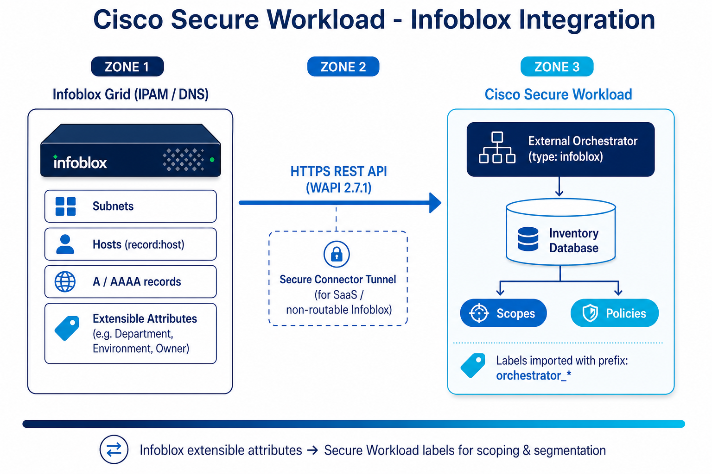

# Cisco Secure Workload → Infoblox Integration Guide

A step-by-step integration guide for enriching Cisco Secure Workload (CSW) inventory with **Infoblox IPAM/DNS metadata** via the **Infoblox External Orchestrator**. Imported Infoblox *extensible attributes* become Secure Workload **labels** you can use for scopes and micro-segmentation policies.

[-0090DA)](https://www.infoblox.com/)

> **⚠ Disclaimer:** This is a **community reference guide** prepared by Cisco Solutions Engineering — not an official Cisco product document. Always refer to the [official Cisco Secure Workload documentation](https://www.cisco.com/c/en/us/support/security/tetration/series.html) and the [Compatibility Matrix](https://www.cisco.com/c/m/en_us/products/security/secure-workload-compatibility-matrix.html) for authoritative, up-to-date guidance.

---

## What This Covers

| Area | Detail |
|---|---|
| **Integration type** | External Orchestrator (`type: infoblox`) — inventory **enrichment / labels** |
| **Data imported** | Subnets, hosts (`record:host`), A/AAAA records **with extensible attributes** |
| **Transport** | HTTPS to Infoblox **WAPI** (REST API), TCP/443 |
| **WAPI versions** | 2.6, 2.6.1, 2.7, 2.7.1 (2.7.1 recommended) |
| **Connectivity** | Direct (on-prem) or via **Secure Connector** tunnel (SaaS / non-routable) |
| **Result** | Infoblox attributes → CSW labels prefixed `orchestrator_` |
| **Verified against** | CSW 4.x on-prem and SaaS |

---

## Quick Start

### Prerequisites
- Infoblox Grid with **IPAM/DNS** and **WAPI (REST API)** enabled and reachable over HTTPS
- A dedicated **read-only** Infoblox service account with API access
- **Extensible attributes** attached to the hosts/records you want to label
- CSW 4.x with Site Admin / Root Scope Owner rights
- (SaaS only) A healthy **Secure Connector** tunnel
- Firewall: HTTPS (TCP/443) from CSW source → Infoblox Grid member(s)

### Steps (summary)

**On Cisco Secure Workload:**
1. `Manage → External Orchestrators → Create New Configuration`
2. Set **Type = Infoblox**; enter Name, Username, Password, Full Snapshot Interval (start `3600`)
3. **Hosts List** → add Grid member(s), port `443` (add more members for HA)
4. Select record types (networks / hosts / A / AAAA); check **Secure Connector Tunnel** for SaaS
5. Click **Create** (allow ~1 min for status; up to 1 hr for first full snapshot)

**Verify:**
1. `Investigate → Inventory Search`
2. Run `orchestrator_system/orch_type = infoblox`
3. Run an attribute query, e.g. `orchestrator_Department = Finance`
4. Use `orchestrator_*` labels to build **scopes** and **policies**

See the [full step-by-step guide](CSW-Infoblox-Integration-Guide.md) or [open the HTML version](CSW-Infoblox-Integration-Guide.html) for detailed instructions.

---

## Video Walkthrough

> **Legend:** 🎬 video · 📘 guide · 📄 doc

The official Cisco Secure Workload channel walks through the integration:

▶ **[Watch: Cisco Secure Workload — Infoblox Integration](https://www.youtube.com/watch?v=gdhMWviAZig)**

| Stage | Topic |
|---|---|
| Overview | Why Infoblox extensible attributes make great CSW labels |
| Setup | External orchestrator (type Infoblox), hosts list, credentials |
| Records | Selecting networks / hosts / A / AAAA |
| Verify | Inventory search with `orchestrator_*` labels |
| Apply | Building scopes and policies from imported attributes |

---

## Architecture Diagram

*The Infoblox external orchestrator polls the Grid over HTTPS/WAPI, imports hosts and A/AAAA records that carry extensible attributes, and publishes them as `orchestrator_*` labels into the CSW inventory database — driving scopes and enforcement policies.*

---

## Files in This Repo

| File | Description |
|---|---|
| [`README.md`](README.md) | This file — quick start and overview |
| [`CSW-Infoblox-Integration-Guide.md`](CSW-Infoblox-Integration-Guide.md) | Full step-by-step guide (Markdown source) |
| [`CSW-Infoblox-Integration-Guide.html`](CSW-Infoblox-Integration-Guide.html) | Styled HTML — open in browser for best experience (includes embedded YouTube player) |
| [`csw-infoblox-architecture.png`](csw-infoblox-architecture.png) | Architecture diagram |
| [`build.sh`](build.sh) | Regenerate HTML/PDF from Markdown (requires pandoc + Chrome) |
| [`docs/CUSTOMER-HANDOFF.md`](docs/CUSTOMER-HANDOFF.md) | Checklist to hand to the customer's Infoblox / IPAM / DNS team |
| [`docs/00-official-references.md`](docs/00-official-references.md) | Curated Cisco + Infoblox reference links |

---

## Imported Labels — Quick Reference

**System labels** (added to every imported object):

| Key | Value |
|---|---|
| `orchestrator_system/orch_type` | `infoblox` |
| `orchestrator_system/cluster_id` | *(CSW cluster id)* |
| `orchestrator_system/machine_id` | *(source machine id)* |
| `orchestrator_system/machine_name` | *(source machine name)* |

**Attribute labels:** every Infoblox extensible attribute → `orchestrator_<AttributeName>` (e.g. `Department` → `orchestrator_Department`).

> **Important:** Only objects **with extensible attributes** are imported. Subnets are **not** searchable in inventory (CSW inventory is IP-based). Limits: **50,000 subnets**, **400,000 hosts + A/AAAA** combined. Infoblox uses **full snapshot** polling (no delta).

---

## Step-by-Step Guides

> **Legend:** 🎬 video · 📘 guide · 📄 doc

Hands-on integration and deployment guides — follow these top to bottom to build out a deployment:

| Guide | Description | Best for |
|-------|-------------|---------|
| [📘 Agent Installation](https://github.com/chandrapati/CSW-Agent-Installation-Guide) | Deploy CSW agents on Linux / Windows / cloud | Day-1 sensor deployment |
| [📘 Policy Lifecycle](https://github.com/chandrapati/CSW-Policy-Lifecycle) | Policy discovery → enforcement workflow | Policy management |
| [📘 ISE / pxGrid](https://github.com/chandrapati/csw-ise-integration) | ISE/pxGrid: user-identity–aware microsegmentation | Identity & Zero Trust |
| [📘 AnyConnect NVM](https://github.com/chandrapati/csw-anyconnect-nvm) | Endpoint process flows + user identity via NVM | Endpoint telemetry |
| [📘 ServiceNow CMDB](https://github.com/chandrapati/csw-servicenow-integration) | ServiceNow CMDB label enrichment for workload scopes | CMDB-driven policy |
| [📘 Infoblox](https://github.com/chandrapati/csw-infoblox-integration) | Infoblox IPAM/DNS extensible-attribute label enrichment | IPAM/DNS-driven policy |
| [📘 F5 BIG-IP](https://github.com/chandrapati/csw-f5-integration) | F5 virtual-server labels, policy enforcement, IPFIX flow visibility | Load balancer segmentation |
| [📘 NetScaler ADC](https://github.com/chandrapati/csw-netscaler-integration) | NetScaler LB virtual-server labels, ACL enforcement + AppFlow/IPFIX flow visibility | Load balancer segmentation |
| [📘 AWS Connector](https://github.com/chandrapati/csw-aws-connector) | EC2 tag ingestion + VPC flow logs + Security Group enforcement | AWS workloads |
| [📘 Azure Connector](https://github.com/chandrapati/csw-azure-connector) | Azure VM tag ingestion + VNet flow logs + NSG enforcement | Azure workloads |
| [📘 GCP Connector](https://github.com/chandrapati/csw-gcp-connector) | GCE label ingestion + VPC flow logs + firewall enforcement | GCP workloads |
| [📘 NetFlow](https://github.com/chandrapati/csw-netflow-integration) | NetFlow v9/IPFIX agentless flow ingestion from switches | Network fabric visibility |
| [📘 ERSPAN](https://github.com/chandrapati/csw-erspan-integration) | Agentless packet mirroring for legacy / OT / IoT devices | Deep agentless visibility |
| [📘 Secure Firewall](https://github.com/chandrapati/CSW-Secure-Firewall-Integration-Guide) | NSEL flow ingestion from Cisco Secure Firewall (FTD/ASA) | Firewall flow visibility |
| [📘 Splunk Integration](https://github.com/chandrapati/csw-splunk-integration) | CSW syslog alerts → Splunk SIEM | SecOps / SIEM teams |

## Resources

> **Legend:** 🎬 video · 📘 guide · 📄 doc

Learning paths, reference material, and day-2 tooling:

| Resource | Description | Best for |
|----------|-------------|---------|
| [📘 User Education](https://github.com/chandrapati/CSW-User-Education) | Onboarding guides, concept explainers, and curated video library | New CSW users |
| [📘 Compliance Mapping](https://github.com/chandrapati/CSW-Compliance-Mapping) | Map CSW controls to NIST, PCI-DSS, HIPAA, CIS | Compliance & audit |
| [📘 Tenant Insights](https://github.com/chandrapati/CSW-Tenant-Insights) | Tenant-level reporting and analytics | Visibility metrics |
| [📘 Operations Toolkit](https://github.com/chandrapati/CSW-Operations-Toolkit) | Day-2 ops scripts: health checks, reporting, policy analysis | Ongoing operations |
| [📄 Supported OS & Compatibility Matrix](https://www.cisco.com/c/m/en_us/products/security/secure-workload-compatibility-matrix.html) | Cisco's authoritative list of supported agent operating systems, external systems, and connector requirements | Platform planning & prerequisites |

> **Suggested customer journey:**
> User Education → Agent Installation → Policy Lifecycle → ISE/pxGrid → ServiceNow CMDB → Infoblox → F5 BIG-IP → NetScaler ADC → Splunk Integration → Compliance Mapping → Operations Toolkit
